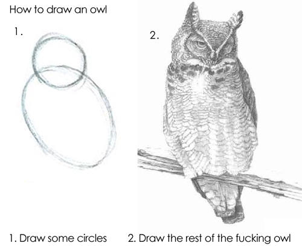
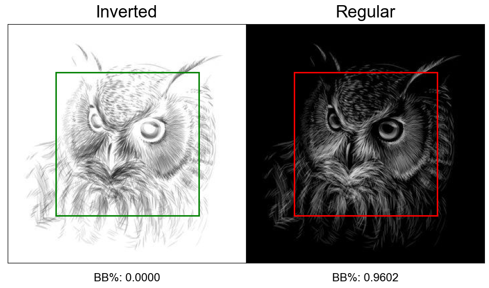
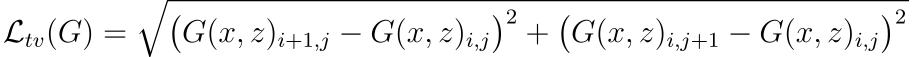
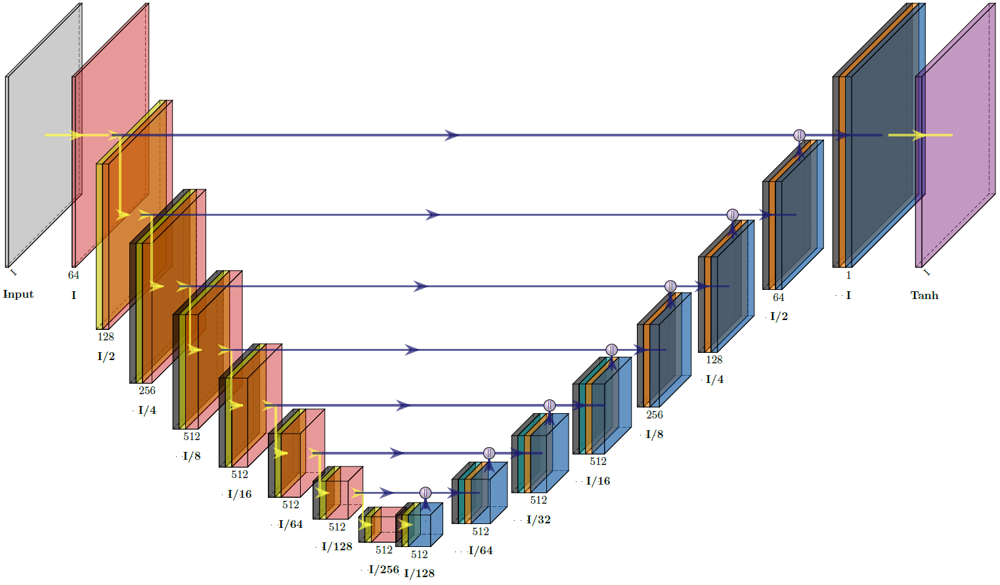
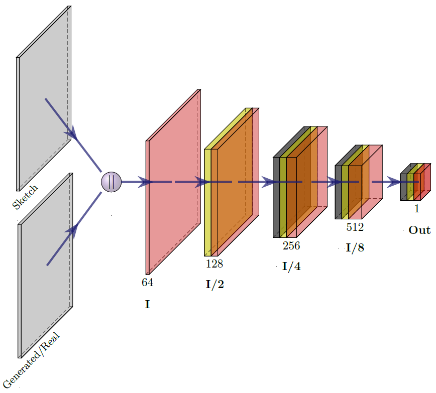

# Rest of the Owl

**Author**: Joshua Gottlieb

## Usage Information and Known Bugs

All models were compiled using Tensorflow v2.11. 

Known Bugs:
<ul>
  <li>The [get_black_border_percentage()](./notebooks/src/preprocessing.py) function originally failed to account for the corners of the image. The function itself has been fixed, but the model has been trained on images selected using the buggy version of this function.</li>
  <li>The [select_images_and_sketches()](./notebooks/src/preprocessing.py) function will select inverted versions of images in cases where both regular and inverted versions meet the criteria for selection.</li>
  <li>The logging step of [train_step_pix2pix()](./notebooks/src/modeling/pix2pix.py) and [train_step_autopainter()](./notebooks/src/modeling/autopainter.py) writes to a .csv file, but the log file is not properly formatted for reading as .csv file in Excel or Pandas. A [parse_logs()](./notebooks/src/model_analysis/logs.py) function is available for parsing these logs.</li>
  <li>The logging step of [calculate_fid_for_epoch_and_model()](notebooks/src/model_analysis/fid.py) writes to a .csv file, but it writes everything as essentially one long string. A [parse_fid_logs()](./notebooks/src/model_analysis/logs.py) is available for parsing these logs.</li>
</ul>

A minimal usage set of data,  and all model weights can be found at this [Google Drive](https://drive.google.com/drive/folders/1G_lOUjNFyL0Vx2cLZQDXYWASLBHe4jL8?usp=share_link).

If any of the images in this README fail to load or are not legible due to Github dark mode, all of the visuals contained exist in the [visualizations](./visualizations) directory of this repository or in the [presentation](./presentation/Rest-of-the-Owl-Presentation.pdf).

## Overview and Research

|  |
| :---: |
| [Know Your Meme - Rest of the Owl](https://knowyourmeme.com/memes/how-to-draw-an-owl) |

This seemingly comical internet meme inspired an important research question for me. Is it actually possible to take a low-quality sketch of an image and produce a high-quality sketch using neural networks? Low-detail sketches contain very little information, so this seemed like it would be a difficult project, and while my intuition was not wrong about the difficulty of such a task, it turns out that sketch-to-image synthesis is a current domain of research, with papers published on the topic as recently as 2021.

In researching this topic, I stumbled upon the paper [Auto-painter: Cartoon Image Generation from Sketch by Using Conditional Generative Adversarial Networks](https://arxiv.org/pdf/1705.01908.pdf), which was subsequently based upon the "pix2pix" model published in [Image-to-Image Translation with Conditional Adversarial Networks](https://arxiv.org/pdf/1705.01908.pdf). These two papers detailed neural networks which were capable of image-to-image synthesis, which is exactly what I wanted to achieve with my sketch-to-sketch idea. Conveniently, both of these models share similar architectures, and so I adapted my model architecture and loss functions from these two papers and named my models "autopainter" and "pix2pix," respectively. Unfortunately, the [original autopainter model](https://github.com/irfanICMLL/Auto_painter) was written in Tensorflow v1, while the [original pix2pix model](https://github.com/phillipi/pix2pix) was written in PyTorch. Fortunately, there exists a [Tensorflow v2.x tutorial for pix2pix](https://www.tensorflow.org/tutorials/generative/pix2pix), which I was able to use to help translate the original models into a Tensorflow v2.x architecture.

The purpose of this project is to create and train a conditional generative adversarial network (cGAN) which can take in low-detail "sketches" and produce high-detail sketches.
  
## Data Collection

For data, I used [requests](https://requests.readthedocs.io/en/latest/) and [BeautifulSoup](https://beautiful-soup-4.readthedocs.io/en/latest/) to scrape [Adobe Stock](https://stock.adobe.com/), [VectorStock](https://www.vectorstock.com/), and [Fine Art America](https://fineartamerica.com/). I scraped around ~30,000 images; ~20,000 from Adobe Stock, ~4,000 from VectorStock, and ~6,000 from Fine Art America. In order to choose my images, I manually inspected ~17,000 images, ending with 2,880 images.

My criteria for selecting images was relatively simple. Images needed to have:
<ul>
  <li>Medium-High levels of detail in order to generate lower levels of sketches.</li>
  <li>Only a single owl present in the photo, with no other animals present.</li>
  <li>Realistic drawings/photos, and not look like cartoon images or metallic creations.</li>
  <li>No text visible in the image.</li>
  <li>Minimal background objects (the main ones which I allowed were branches/trees and moons).</li>
  <li>No glasses or hats.</li>
</ul>

For examples of images that failed to meet these criteria, see the [dropped subfolder](./visualizations/dropped) in this repository, or check out slide/page 4 of the [presentation](./presentation/Rest-of-the-Owl-Presentation.pdf).

## Data Cleaning and Sketch Generation

In order to train my model, I needed sketch/image pairs, but my scraping only provided me with images. Thus, I created my own sketches using the eXtended Difference of Gaussians (XDoG) technique outlined in [XDoG: An eXtended difference-of-Gaussians compendium
including advanced image stylization](https://users.cs.northwestern.edu/~sco590/winnemoeller-cag2012.pdf). Specifically, I used the Python implementation of the baseline XDoG model using a continuous ramp, [available here](https://github.com/heitorrapela/xdog). The DoG process works by applying two separate Gaussian Blurs to an image, one very weak, one very strong, and calculating a weighted difference between the two blurred images. The XDoG process furthers this by applying thresholding to each pixel and ramping each pixel from black to white to create a simple yet effective edge detection algorithm. Illustrated below is the process applied to an image.

| Ground-Truth | Weak Blur | - γ * Strong Blur |
| :--: | :--: | :--: |
|  |  |  |

| Apply Differencing |
| :--: |
|  |
| Apply Thresholding |
|  |

The threshold statistic underneath each image indicates the percentage of the image that is covered in "black" pixels (value <= 40). This is a self-made measurement for the amount of detail each sketch has. Observe how different starting images require different gamma values to obtain the same fill-threshold.

| |
| :--: |

In an attempt to normalize the detail levels of each of my sketches, I decided to create sketches based upon fill thresholds rather than by applying a single gamma value across my dataset. After inspecting ~50 images at different thresholds, I settled on a threshold 0.03 as having the best balance of low-detail while not losing general shapes and features that should be captured.

Some images consisted mainly of black images with white highlights. In an attempt to normalize my images as being black drawings on white backgrounds, I decided to invert some of my images. The decision on whether or not to invert an image was done by examining how much of the border was "black" (again, value <= 40). The theory is that images which are on black backgrounds will exhibit a high black-border percentage, while images which are on white backgrounds will exhibit a low black-border percentage.

| Image which should be inverted |
| :--: |
|  |
| Image which should not be inverted |
|  |

The area of the image that I used for the border was the outer 40% of the image. My threshold for determining if an image should be inverted is a 40% black-border percentage, which is a number I settled on through manual inspection of ~50 images. If a regular image has >40% black-border percentage, the inverted version should be used, and vice-versa, as the inverted version of a regular image will have a high black-border percentage.

In order to remove duplicates, I used the [difPy package](https://github.com/elisemercury/Duplicate-Image-Finder/wiki/difPy-Usage-Documentation) to select the highest resolution versions of each image. Finally, after choosing which version of each image to use and generating sketches, the images and sketches were resized to 256x256 with zero-padding to preserve aspect ratio. The sketches and images were then concatenated together horizontally, as specified in the [Tensorflow v2.x tutorial for pix2pix](https://www.tensorflow.org/tutorials/generative/pix2pix), for use in preprocessing for modeling.

## Model Architecture

| Generator Training Loop | Discriminator Training Loop |
| :--: | :--: |
|  |  |
| [Generator Loop - Pix2Pix Tutorial](https://www.tensorflow.org/tutorials/generative/pix2pix#define_the_generator_loss) | [Discriminator Loop - Pix2Pix Tutorial](https://www.tensorflow.org/tutorials/generative/pix2pix#define_the_discriminator_loss) |

Both of my models follow a modified cGAN architecture, where the generator and discriminator take turns training each other. The generator creates a fake image from an input sketch. The discriminator takes in the sketch/ground-truth pair and makes a prediction on whether such a pair is probable, and then separately takes in the sketch/generated-image pair and makes a prediction on whether the pair is probable. The discriminator's job is to classify sketch/ground-truth pairs as probable and to classify sketch/generated-image pairs as improbable. The generator's job is to create generated-images that can fool the discriminator. Losses and gradients are then calculated, and weights are updated before training again.

While the pix2pix and autopainter models referenced in their respective papers differ slightly in architecture, my versions utilize the same architecture, differing only in their loss functions.

| pix2pix Losses |
| :--: |
|  |
|  |
|  |

The pix2pix losses are relatively simple. `G` stands for the generator, `D` for the discriminator, `x` for the sketch, `y` for the ground-truth image, `z` for the noise, and `G(x,z)` for the generated image. The cGAN loss is defined as the log loss of the discriminator's ability to correctly identify sketch/ground-truth pairs and sketch/generated-image pairs. The discriminator seeks to minimize this loss, while the generator seeks to maximize this loss. In addition, an L1 pixel-level loss is calculated for the generator to ensure that the generated image does not vary drastically from the real image. The weights for each loss are the same as those used in the pix2pix Tensorflow tutorial.

| autopainter Losses |
| :--: |
|  |
|  |
|  |

The autopainter losses build upon the pix2pix losses, with two additional loss functions defined as part of the generator loss. The feature loss uses the L2 distance between the feature maps for the real image and the feature maps for the generated image at a specific layer of a convolutional net `φ` in order to maintain overall feature and shape consistency in generated images. Following the autopainter paper, I used a VGG16 net and used the `Conv3_3` layer for the feature maps. The total variation loss consists of the root of the sum of squared errors between the generated image and shifted versions of itself. This ensures that the total variation of the generated images is dampened, preventing sharp changes in color (in the case of grayscale images, brightness) in the generated image and produces a smoothing effect on generated images. Both of these losses are added to the pix2pix losses to create the autopainter loss, with the weights for each loss identical to those used in the autopainter models available on GitHub.

The generator and discriminator are composed of a series of downsamplers and upsamplers.

| Downsampler | Upsampler |
| :--: | :--: |
|  |  |

(The above visualizations have the Conv2D/Conv2DTranspose layers last to best match the following visualization of the whole generator and discriminator models. The actual implementation in code applies the Conv2D/Conv2DTranspose layers first, with the activation layers last. All of these visualizations were created using LaTeX and custom layers from [PlotNeuralNet](https://github.com/HarisIqbal88/PlotNeuralNet).)

Each downsampler consists of a Conv2D layer, with an optional BatchNormalization layer, and a [Leaky ReLU](https://www.tensorflow.org/api_docs/python/tf/keras/layers/LeakyReLU) activation (with an alpha of 0.2, as used in both pix2pix and autopainter papers). Each upsampler consists of a Conv2DTranspose layer, with BatchNormalization, an optional Dropout, and a ReLU activation.

| Generator |
| :--: |
|  |
| Discriminator |
|  |

`I` stands for the original image dimensions, and the number under each layer represents the number of filters used for that layer.

The generator follows a U-net architecture, using 8 downsamplers and 7 upsamplers. The sketch is processed sequentially through the downsamplers and upsamplers, with copies of the sketch passed to each upsampler across from the same depth level downsampler in order to preserve spatial and high-level feature information obtained from earlier downsampling layers. Unlike a traditional generator in the cGAN architecture, no random noise vector is added as an input. Instead, the BatchNormalization and Dropout layers of the generator act to introduce noise into the image. The generator's final output uses a Tanh activation to create the generated image.

The discriminator begins by concatenating the sketch and real or generated image together, before using a PatchGAN architecture (detailed in the [pix2pix paper](https://arxiv.org/pdf/1705.01908.pdf)) to convolutionally evaluate the structure of the sketch/image pair in local regions, using 5 downsampling blocks. Instead of the final layer having a Sigmoid activation, the discriminator outputs a 1 filter mask of the sketch/image pair which is passed into a [BinaryCrossEntropy](https://www.tensorflow.org/api_docs/python/tf/keras/losses/BinaryCrossentropy) loss object to calculate sketch/image probabilities.

## Results

Both models were trained for 200 epochs using a Google Colab premium GPU. A more detailed breakdown of the losses can be found in the [Model Analysis Notebook](/notebooks/Model-Analysis.ipynb).

### Quantitative Results

| pix2pix losses |
| :--: |
|  |
| autopainter losses |
|  |

Because the cGAN architecture has no single objective loss function and instead incentivizes the generator and discriminator losses to fluctuate as the models compete, it is difficult to ascertain where the ideal training point is for the model. As a rule of thumb, an ideal discriminator loss is at ln(2) ~ 0.69, as this represents equal uncertainty in determining the truthfulness of sketch/ground-truth and sketch/generated-image pairs, and it can be seen that this occurs in the pix2pix model between epochs 80 and 100, and again at epoch 140. The autopainter model performs similarly to the pix2pix model, minimizing generator loss in the 60-80 epoch range and hitting ideal discriminator loss around epoch 100.

A commonly used metric for evaluating the health of cGANs is the Frechét Inception Distance (FID), introduced in [GANs Trained by a Two Time-Scale Update Rule
Converge to a Local Nash Equilibrium
](https://arxiv.org/pdf/1706.08500.pdf). The FID is calculated by first computing the Inception embeddings for each real and generated image in the training dataset, found by using the vector representation of the final global pooling layer of the Inception v3 model for each image. Lower FID scores are correlated with higher quality generated images. I used the Python implementation of the FID score detailed in [How to Evaluate GANs using Frechet Inception Distance](https://wandb.ai/ayush-thakur/gan-evaluation/reports/How-to-Evaluate-GANs-using-Frechet-Inception-Distance-FID---Vmlldzo0MTAxOTI).

| FID Scores |
| :--: |
|  |

The article that introduced the FID states that a minimum of 10,000 samples should be used to calculate the FID, with a recommended amount of at least 50,000 samples. Unfortunately, my training dataset consisted only of 1,905 samples, which means the FID score is prone to high variance. However, the FID scores shown above agree with the loss graphs examined earlier, achieving minimums in the 70-110 epoch range, further confirming that this is the ideal epoch range for this training session.

### Qualitative Results

| Good Results |
| :--: |
|  |

In these examples, both models performed well in recreating the original image from the low-detail sketch. Autopainter appears to outperform pix2pix in many instances due to the smoothing properties of its loss functions, which help reduce prevent jagged coloration, such as in the far left owl (although if one preferred an almost Van Gogh art style, pix2pix would be a great choice). The extra loss functions in autopainter also help reduce fitting to noise and "smudging" artifacts, such as in the second owl. Despite the earlier quantitative analysis suggesting that the optimal training epochs appeared in the 80-140 range, there are still some interesting results in the images generated beyond that range. In particular, the far right owl was able to become darker in the autopainter model at 200 epochs, more closely approximating the ground-truth levels of brightness.

| Bad Results |
| :--: |
|  |

While the models performed well overall, there were also many images where the model failed to produce a realistic sketch. These reasons can be broken down into a few main categories. The first category is when an image had too dark of a background, as in the cast of the far left owl. Even though I attempted to choose the correct version of images between inverted/regular, some images slipped through my selection process. The sketch for the far left mostly picked up the background, losing all of the features of the owl itself. The resulting image is impressive when compared to the sketch, but clearly falls short of the ground-truth image. The second category is when an image has high levels of fine detail with some spots of "heavy strokes" that are very dark. The second and third owls fall into this category, as they have high definition on their wings, but very dark wing borders and facial features, resulting in sketches with low detail on the bodies. The final category is when the owl is too low in detail and the rest of the image is too dark and has too much detail, as exemplified by the far right owl. The sketch for the far right owl mainly captures the black moon in the background, and fails to capture anything more than the faintest outline of the owl itself. With almost no information to work with, the models fail to produce reasonable results.

Most of these failures to produce results can be attributed to bad starting images resulting in poor sketch creations, which could be prevented with more careful selection of images and further refinement of the sketch creation process.

| Non-Owl Results |
| :--: |
|  |

In order to test the effectiveness of my models, I decided to test their generative abilities on non-owl images. As can be seen, the model has done a good job of reproducing the high-detail cat image on the left. It has not added feathers to the cat, which shows that, despite being trained specifically on owls, the models are actually performing edge and detail synthesis from low-detail images, not creating owls out of sketches. This is good, because it shows that the models can generalize beyond their training domain. Interestingly, the smoothing action of the autopainter model causes some issues in reproducing the cat picture, as it fails to capture any of the specular highlights present in the picture. Pix2pix does not have the same issue.

The [owl-bear](https://forgottenrealms.fandom.com/wiki/Owlbear) (a Dungeons & Dragons monster with the body of a bear and head of an owl) in the center produces middling results, as the sketch-generation process produced a very low detail sketch in comparison to the ground-truth image. For the person on the left, the results of both models are good, but once again, the smoothing action of the autopainter model causes it to struggle to reproduce the facial hair of the man, whereas pix2pix does a much better job. The pix2pix version does suffer from smudging noise artifacts which are mostly absent in the autopainter model.

## Conclusions and Next Steps

With clever usage of cGAN architectures it is possible to perform sketch-to-image synthesis, allowing aspiring artists to turn their low-level sketches into higher-detail images to aid in the creative process.

Further improvements that I might implement include:
<ul>
  <li>Acquiring more data and more carefully curating input images.</li>
  <li>Tweaking the sketch-generation algorithm.</li>
  <li>Adjusting the black-boder-percentage algorithm.</li>
  <li>Adjusting the hyperparameters in the model loss functions, and testing different nets beyond VGG16.</li>
</ul>

In particular, there are many different varieties of the XDoG algorithm, and while I decided to use a global fill-threshold for all of my images, it might be better to use a relative fill-threshold (sketch fill-percentage / ground-truth fill-percentage) in order to maintain a better sketch/ground-truth detail ratio.

## For More Information

Please look at my full analysis in [Jupyter Notebooks](./notebooks) and code in my [Python Modules](./notebooks/src), or my [presentation](./presentation/Rest-of-the-Owl-Presentation.pdf).

For any additional questions, please contact: **Joshua Gottlieb (joshuadavidgottlieb@gmail.com)**

## Repository Structure

